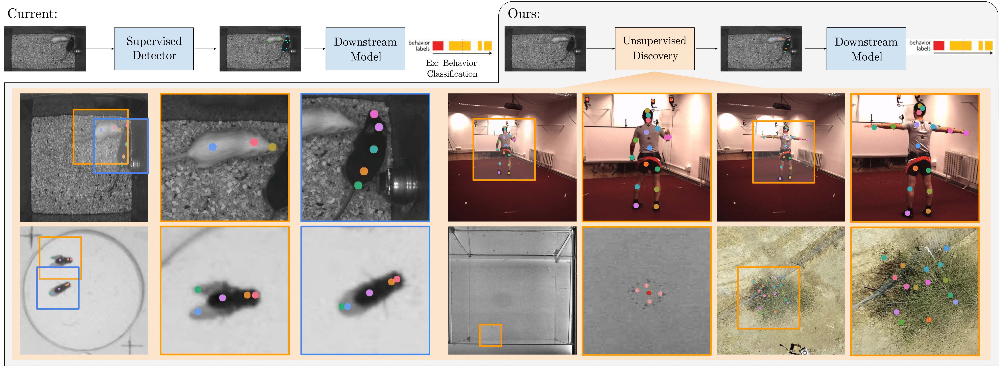
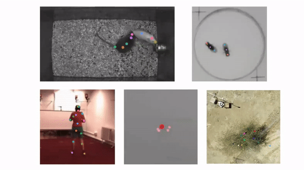

# B-KinD: Self-supervised keypoint Discovery in Behavioral Videos

<p align="center"></p> 


Implementation from the paper:
>Jennifer J. Sun*, Serim Ryou*, Roni Goldshmid, Brandon Weissbourd, John Dabiri, David J. Anderson, Ann Kennedy, Yisong Yue, Pietro Perona, [Self-Supervised Keypoint Discovery in Behavioral Videos](https://arxiv.org/pdf/2112.05121.pdf). In Conference on Computer Vision and Pattern Recognition (CVPR), 2022

B-KinD discovers keypoints without the need for bounding box annotations or manual keypoint, and works on a range of organisms including mice, humans, flies, jellyfish and tree. The discovered keypoints and additional shape features are directly applicable to downstream tasks including behavior classification and pose regression!

<p align="center"></p> 

Our code currently supports running keypoint discovery on your own videos, where there's relatively stationay background and no significant occlusion. Features in progress (let us know in the issues if there's anything else you'd like to see!):
- Support for keypoint detection on bounding boxes
- Support for multiple similar agents

# Quick Start
Follow these instructions if you would like to quickly try out training B-KinD on CalMS21 and Human 3.6M and using discovered keypoints in downstream tasks. Please see these instructions on [setting up a new dataset](https://github.com/neuroethology/BKinD#your-own-dataset) to apply B-KinD on your own dataset.

Tested on torch 1.9.0.

## CalMS21
1. Download CalMS21 dataset: https://data.caltech.edu/records/1991
   - For training keypoint discovery (contains videos): task1_videos_seq.zip
   - For training behavior classification (contains behavior annotations for evaluation): task1_classic_classification.zip
2. Extract frames from video
   -  Use the code provided by CalMS21 in seq_image_extraction.zip to extract images for all the downloaded seq files.
   - There should be one image directory for the train split, and one image directory for the test split.
     Within each directory, there should then be directories of images corresponding to each video.
3. Run command
```
python train_video.py --config config/CalMS21.yaml
```
This will take 1~2 days on a single GPU, the keypoints converge around epoch 10.

### Behavior classification
1. One you are done training keypoint discovery model, evaluate it on the CalMS21 task 1 data on the default split.
   The classification code is provided by [1]: https://gitlab.aicrowd.com/aicrowd/research/mab-e/mab-e-baselines
2. To evaluate using our keypoints, first extract keypoints for all images in CalMS21 task 1:
```
python extract_features.py --train_dir [images from train split CalMS21] --test_dir [images from test split CalMS21]
 --resume [checkpoint path] --output_dir [output directory to store keypoints]
```
3. Convert the extracted keypoints to the npy format for the CalMS21 baseline code:
```
python convert_discovered_keypoints_to_classifier.py --input_train_file [calms21_task1_train.json from step 1b) above] --input_test_file [calms21_task1_test.json from step 1b) above] --keypoint_dir_train [keypoints_confidence/train extracted in previous step]  --keypoint_dir_test [keypoints_confidence/test extracted in previous step]
```
The data is automatically saved into the data/ directory.

4. Use the saved npy files in data in the CalMS21 classifier code (train_task1.py). Note that the default code from [1] only handles input keypoints. We provide a modified version that reads in keypoints, confidence and covariance in the classifier/ directory.
```
python classifier/train_task1.py **
```
** Need to set train_data_path and test_data_path inside the train_task1.py file to the files generated from the previous step.


## Human 3.6M
1. Download Human 3.6M dataset: http://vision.imar.ro/human3.6m/description.php (Ask for permission to authors)
2. Extract frames from videos
   - Our implementation uses this code (https://github.com/anibali/h36m-fetch) for frame extraction
   - Dataloader for h36m (dataloader/h36m_dataset.py) has to be updated if you extract frames using a different code.
3. Run command
```
python train_video.py --config config/H36M.yaml
```

### Pose regression on Simplified Human 3.6M
1. Once you are done with training keypoint discovery model, evaluate pose regression task on Simplified Human 3.6M dataset
2. Simplified Human 3.6M Dataset is publicly available here from [2]: http://fy.z-yt.net/files.ytzhang.net/lmdis-rep/release-v1/human3.6m/human_images.tar.gz
3. Run command
```
python test_simplehuman36m.py [path_to_simplified_h36m_dataset**] --checkpoint [path_to_model_directory] --batch-size [N] --gpu 0 --nkpts [K] --resume [path_to_model_file]
```
*Note that [path_to_h36m_dataset] should end with 'processed' directory
**[path_to_simplified_h36m_dataset] should end with 'human_images' directory

Regression results may vary since our method does not use any keypoint label as a supervision signal while training the keypoint discovery model.


## Your own dataset
Please follow the instructions below if you would like to train B-KinD on your own video dataset! Note that the code currently does *not* support: tracking for multiple agents with similar appearance, videos with a lot of background motion, and/or videos with a lot of occlusion or self-occlusion. 

1. Extract frames and put all the frames in the "data/custom_dataset" directory. There are many ways to extract frames - for example, using ffmpeg:
```
ffmpeg -i [input_video_name] [output_directory]/images_%08d.png
```
2. Directory structure should follow the format below:
```
data/custom_dataset
    |---train
        |---video1
            |---image0.png
            |---image1.png
            |---    .
            |---    .
        |---video2
        |---   .
        |---   .
    |--val
        |---videoN
```
*Image file names should be in an ascending order for sampling pair of images sequentially

3. Set up the configuration of your data in ``config/custom_dataset.yaml``
4. Run command
```
python train_video.py --config config/custom_dataset.yaml
```
5. To extract additional features from the discovered heatmap, run command
```
python extract_features.py --train_dir [images from train split] --test_dir [images from test split]
 --resume [checkpoint path] --output_dir [output directory to store keypoints]
```

## License

Please refer to our paper for details and consider citing it if you find the code useful:
```
@article{bkind2021,
  title={Self-Supervised Keypoint Discovery in Behavioral Videos},
  author={Sun, Jennifer J and Ryou, Serim and Goldshmid, Roni and Weissbourd, Brandon and Dabiri, John and Anderson, David J and Kennedy, Ann and Yue, Yisong and Perona, Pietro},
  journal={arXiv preprint arXiv:2112.05121},
  year={2021}
}
```

Our code is available under the [Apache License 2.0](https://www.apache.org/licenses/LICENSE-2.0).

[1] Sun et al., The Multi-Agent Behavior Dataset: Mouse Dyadic Social Interactions. NeurIPS 2021.

[2] Zhang et al., Unsupervised discovery of object landmarks as structural representations. CVPR 2018.
